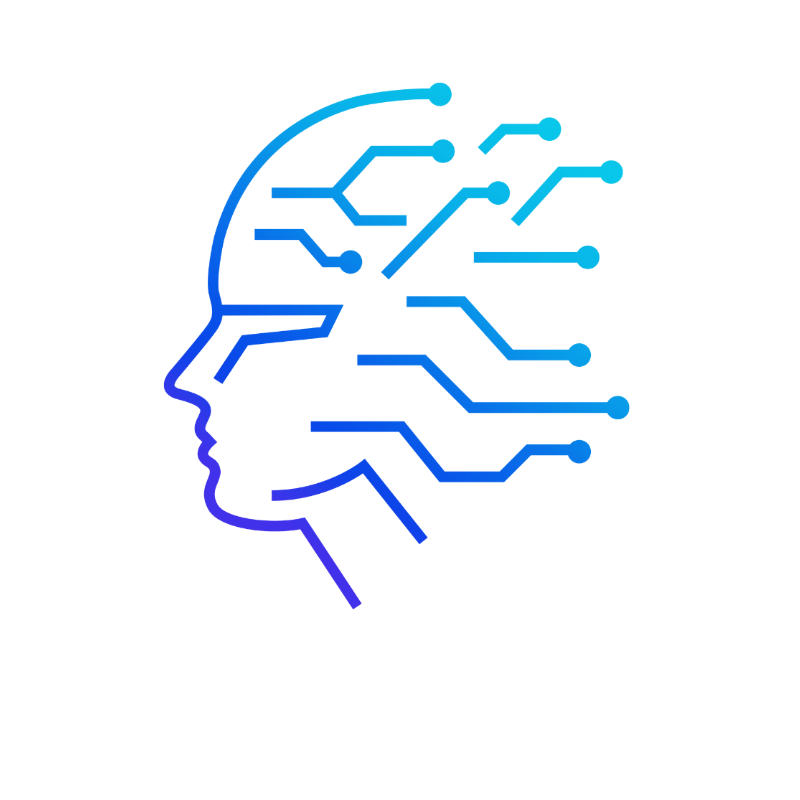
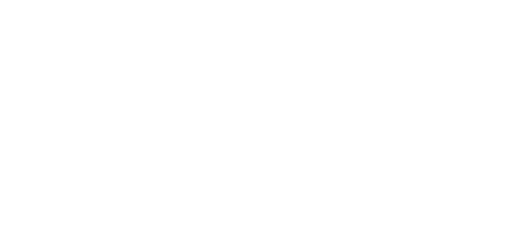

# LinkedIn Discord Widget

Este é o repositório do **LinkedIn Discord Widget**, um widget simples desenvolvido para conectar seu LinkedIn ao Discord utilizando um webhook.

## NOTA:
```
Este projeto está em construção, podendo ocorrer ainda instabilidades na conexão direta com o LinkedIn. Acompanhe sempre para saber de futuras atualizações!
```

## 📝 Sobre o Projeto

Este widget é projetado para ser leve e prático, utilizando **HTML, CSS e JavaScript** puro, e é hospedado via **GitHub Pages**.

## 📂 Estrutura do Projeto
```
LinkedInDiscordWidget/
├── docs/                    # Diretório para GitHub Pages
│   ├── index.html           # Página principal do widget
│   ├── style.css            # Arquivo de estilos
│   ├── script.js            # Arquivo JavaScript para lógica do widget
│   └── assets/              # Imagens e recursos estáticos
│       ├── logo-artificial-universe.png
│       ├── logo-exxplorer.png
│       ├── slogan.png
│       └── assinatura-digital.png
├── .gitignore               # Arquivo para ignorar arquivos desnecessários
└── README.md                # Documentação do projeto
```


## 🚀 Deploy e Acesso

O widget está hospedado via **GitHub Pages**. Acesse diretamente através deste [link](https://aiexxplorer.github.io/LinkedInDiscordWidget/) para visualizar a aplicação.

## 🖼️ Imagens e Recursos
<table style="width:100%; border:none;">
    <tr>
        <td><strong>Logo Artificial Universe</strong></td>
        <td align="right"></td>
    </tr>
</table>

## 🛠️ Tecnologias Utilizadas

- HTML
- CSS
- JavaScript

## 📬 Contato

Para mais informações, entre em contato:

- **Email**: [contact@artificialuniverse.tech](mailto:contact@artificialuniverse.tech)
- **LinkedIn**: [Artificial Universe](https://www.linkedin.com/company/artificial-universe)

---

<div align="center"> © 2024 Artificial Universe. Todos os direitos reservados. </div>

<div align="center">
    
</div>

<div align="center">
    
</div>

---

<div align="center">Feito com ❤️ pela equipe da Artificial Universe para melhorar a experiência de integração para desenvolvedores e usuários.</div>
